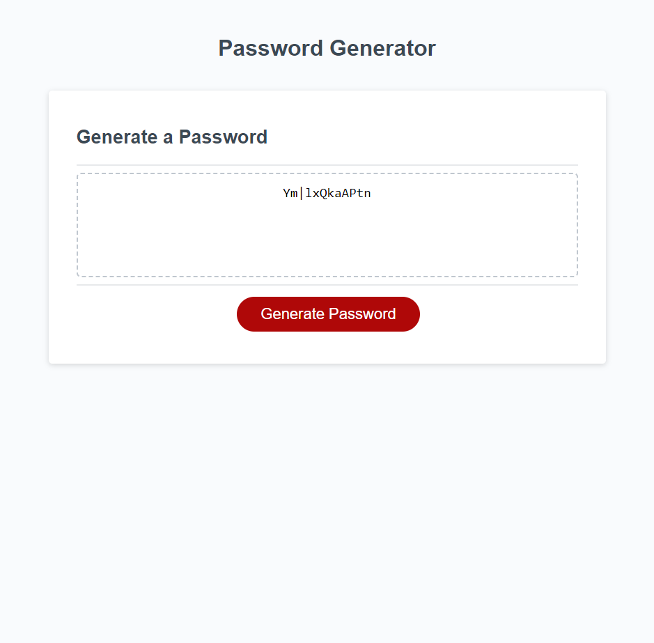

# Radom Password Generator Challenge

## Description

This project creates a random password using JavaScript. The basics of JavaScript were used to write the functionality so that a user could make customs choices for what the password would look like. The password is then displayed on the webpage.

## Installation

The pertinent files for the project, including this README can all be found in the Github repository located at: https://mhalder4.github.io/password-generator-challenge/. The website can be found at the Github pages address that follows: https://github.com/mhalder4/password-generator-challenge.

## Usage

When the webpage loads there is a "Generate Password" button. Upon clicking the button, the user will be prompted for what they want the length of their password to be, and whether they want it to consists of any numbers, lowercase characters, uppercase characters, or special characters. They will then be told if their password is valid and if it is, a password fitting those criteria will be generated and displayed on screen.

## Credits

N/A

## License

MIT License

Copyright (c) 2023 Matthew Halder

Permission is hereby granted, free of charge, to any person obtaining a copy
of this software and associated documentation files (the "Software"), to deal
in the Software without restriction, including without limitation the rights
to use, copy, modify, merge, publish, distribute, sublicense, and/or sell
copies of the Software, and to permit persons to whom the Software is
furnished to do so, subject to the following conditions:

The above copyright notice and this permission notice shall be included in all
copies or substantial portions of the Software.

THE SOFTWARE IS PROVIDED "AS IS", WITHOUT WARRANTY OF ANY KIND, EXPRESS OR
IMPLIED, INCLUDING BUT NOT LIMITED TO THE WARRANTIES OF MERCHANTABILITY,
FITNESS FOR A PARTICULAR PURPOSE AND NONINFRINGEMENT. IN NO EVENT SHALL THE
AUTHORS OR COPYRIGHT HOLDERS BE LIABLE FOR ANY CLAIM, DAMAGES OR OTHER
LIABILITY, WHETHER IN AN ACTION OF CONTRACT, TORT OR OTHERWISE, ARISING FROM,
OUT OF OR IN CONNECTION WITH THE SOFTWARE OR THE USE OR OTHER DEALINGS IN THE
SOFTWARE.